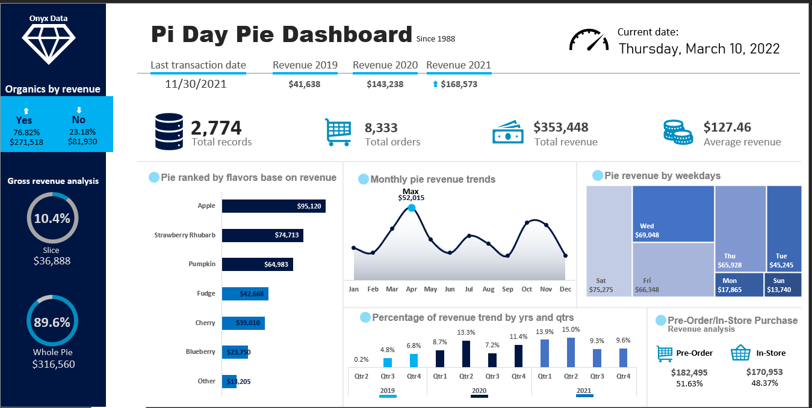

# 🥧 Pie Bakery — Tableau de bord des ventes (2019-2021)

Analyse des performances commerciales d'une pâtisserie américaine spécialisée dans les tartes, et construction d'un tableau de bord Power BI destiné à éclairer les décisions d'exploitation.

---

## Contexte

Pie Bakery vend des tartes, pains et gâteaux, en magasin et en précommande. L'entreprise dispose de trois années d'historique de ventes mais d'aucun outil de pilotage : les décisions d'assortiment, d'ouverture et de production se prennent sans visibilité sur les tendances.

**Objectif :** transformer un fichier de ventes brut en un tableau de bord permettant de répondre à des questions d'exploitation concrètes.

> **Source des données :** jeu de données du challenge public [Onyx Data](https://onyxdata.co.uk/). Période couverte : janvier 2019 → 30 novembre 2021.

---

## Questions posées

1. Comment évolue le chiffre d'affaires cumulé sur la période ?
2. Comment se répartit le revenu par trimestre ?
3. Quels canaux de commande les clients privilégient-ils ?
4. Comment se comparent précommande et achat en magasin selon les jours ?
5. Quelles saveurs contribuent le plus au revenu ?
6. Quelle est la saisonnalité des ventes ?

---

## Méthode

| Étape | Détail |
|---|---|
| Préparation | Nettoyage et typage du fichier de ventes sous Excel, contrôle des valeurs manquantes |
| Modélisation | Import dans Power BI, création des mesures (CA, panier moyen, cumuls, parts) |
| Restitution | Tableau de bord en une page, lisible sans formation préalable |

Un [dictionnaire de données](Data/data-dictionary.xlsx) accompagne le jeu de données.

---

## Résultats

### Les chiffres clés

| Indicateur | Valeur |
|---|---|
| Chiffre d'affaires total | **353 448 $** |
| Commandes | **8 333** |
| Panier moyen | **127,46 $** |

### 1. Une croissance forte, puis une consolidation

| Année | Chiffre d'affaires | Évolution |
|---|---|---|
| 2019 | 41 638 $ | — |
| 2020 | 143 238 $ | **× 3,4** |
| 2021 | 168 573 $ | **+ 18 %** |

L'activité a triplé entre 2019 et 2020, puis la croissance est revenue à un rythme normal. *(2019 est une année partielle : les données ne démarrent qu'au deuxième trimestre.)*

### 2. Le pic d'activité est au printemps, pas en fin d'année

**Le deuxième trimestre est le plus fort** : 15,0 % du chiffre d'affaires en 2021, 13,3 % en 2020. Le mois d'**avril** concentre le maximum avec **52 015 $**.

C'est cohérent avec le métier : le *Pi Day* (14 mars) et Pâques tombent sur cette période, deux temps forts de la vente de tartes aux États-Unis.

👉 **Implication :** la montée en charge de production doit être préparée dès février, et non à l'automne.

### 3. La précommande est devenue le premier canal

| Canal | Chiffre d'affaires | Part |
|---|---|---|
| **Précommande** | 182 495 $ | **51,6 %** |
| Magasin | 170 953 $ | 48,4 % |

L'écart est faible mais la précommande passe devant — un signal à suivre, car elle permet d'anticiper la production et de réduire les invendus.

### 4. Trois saveurs font les deux tiers du revenu

| Saveur | Chiffre d'affaires | Part |
|---|---|---|
| **Apple** | 95 120 $ | **26,9 %** |
| **Strawberry Rhubarb** | 74 713 $ | 21,1 % |
| **Pumpkin** | 64 983 $ | 18,4 % |
| Fudge | 42 668 $ | 12,1 % |
| Cherry | 39 010 $ | 11,0 % |
| Blueberry | 23 750 $ | 6,7 % |
| Autres | 13 205 $ | 3,7 % |

👉 **Implication :** l'assortiment pourrait être resserré. Les saveurs sous 7 % mobilisent des références et du stock pour une contribution marginale.

### 5. Deux jours de la semaine ne rapportent presque rien

| Jour | Chiffre d'affaires |
|---|---|
| Samedi | 75 275 $ |
| Mercredi | 69 048 $ |
| Vendredi | 66 348 $ |
| Jeudi | 65 928 $ |
| Mardi | 45 245 $ |
| **Lundi** | **17 865 $** |
| **Dimanche** | **13 740 $** |

👉 **Implication la plus actionnable de l'analyse :** dimanche et lundi cumulés pèsent **8,9 % du chiffre d'affaires**, contre 21 % pour le seul samedi. L'écart est de 1 à 5,5 entre le meilleur et le pire jour. Il y a une décision d'amplitude d'ouverture à prendre.

### 6. Deux préférences structurelles

- **Tartes entières : 89,6 %** du revenu (316 560 $) contre 10,4 % pour les parts
- **Produits bio : 76,8 %** du revenu (271 518 $)

---

## Ce que je retiens

L'intuition « les tartes, ça se vend à Thanksgiving et à Noël » ne résiste pas aux données : **le vrai pic est au printemps**. C'est le type d'écart entre perception et réalité qu'un tableau de bord sert à révéler.

Les trois décisions que ces données permettent d'instruire : *resserrer l'assortiment*, *revoir les horaires du début de semaine*, *accompagner le basculement vers la précommande*.

## Limites

- Les données de 2019 sont partielles (démarrage au T2), ce qui exagère la croissance 2019 → 2020.
- Aucune donnée de coût : l'analyse porte sur le chiffre d'affaires, pas sur la marge. Une saveur à faible revenu peut être très rentable.
- Aucune information client : pas de mesure de fidélisation ni de récurrence possible.

---

## Explorer le projet

| Fichier | Contenu |
|---|---|
| [`Pie-Day-Dashboard.pbix`](Pie-Day-Dashboard.pbix) | Tableau de bord Power BI, interactif |
| [`Pie-Day-Dashboard.pdf`](Pie-Day-Dashboard.pdf) | Export PDF, si vous n'avez pas Power BI Desktop |
| [`Data/`](Data/) | Jeu de données et dictionnaire |

**Outils :** Power BI Desktop · Excel

---

👤 **Carine FOTSO** — Data Analyst
[LinkedIn](https://www.linkedin.com/in/carinefotso) · [GitHub](https://github.com/krinf15)
